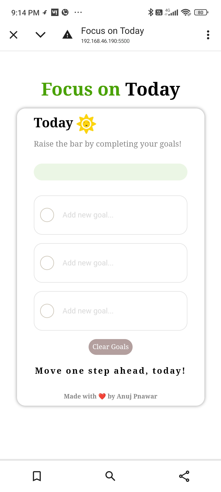

# Focus on Today

## Overview
"Focus on Today" is a web-based productivity application designed to help users track their daily goals and tasks. It allows users to mark tasks as completed and visually tracks their progress with a dynamic progress bar. The app is built using HTML, CSS, and JavaScript, and utilizes localStorage to persist data across sessions.

---

## Features

- **Goal Tracking**: Set and track your daily goals.
- **Progress Bar**: Visual feedback of goal completion with a dynamic progress bar.
- **Task Completion**: Mark tasks as completed by checking checkboxes.
- **LocalStorage Support**: Data is saved in the browser's localStorage to persist between sessions.
- **Responsive Design**: The app adjusts to different screen sizes, ensuring a good experience on mobile, tablet, and desktop.
- **Interactive Feedback**: The progress bar changes colors and provides feedback as you complete more goals.

---

## Technologies Used

- **HTML5**: For the structure of the webpage.
- **CSS3**: Styling and layout, including responsive design.
- **JavaScript**: For interactivity, including DOM manipulation, local storage handling, and progress bar logic.

---

## Usage

1. **Add Goals**: Type a task name in the input field and press Enter or click the checkbox to mark the task as completed.
2. **Track Progress**: The progress bar will visually update based on the number of completed tasks.
3. **Reset Progress**: Click the reset button to reload the page and clear all data from localStorage.

---

## Code Explanation

### JavaScript

- **Saving Goals**: The app uses JavaScript to manage the state of the goals, including their completion status. Data is saved in the browser's `localStorage` to persist even after refreshing the page.
- **Updating Progress**: Each time a task is completed, the `updateProgress` function is called to update the progress bar's width in real-time based on the number of tasks completed.
  
### CSS

- **Layout**: The app uses Flexbox for alignment and layout, ensuring that elements are arranged responsively.
- **Progress Bar**: The `.Child_level` element's width is adjusted dynamically to represent the user's progress, and transitions are applied to make changes smooth.
  
---

## Example

Here's an example of how the application looks:

